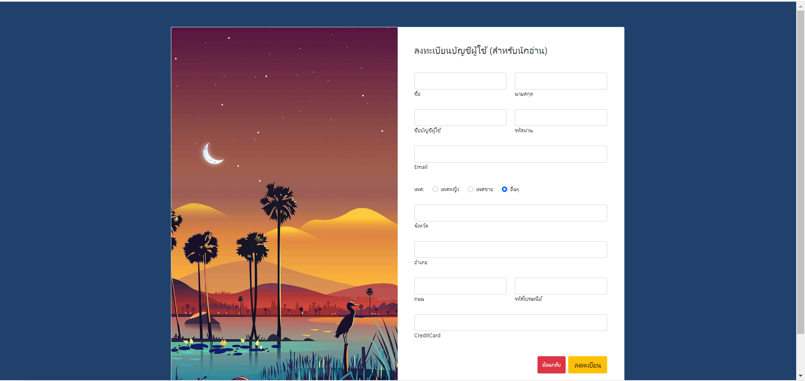
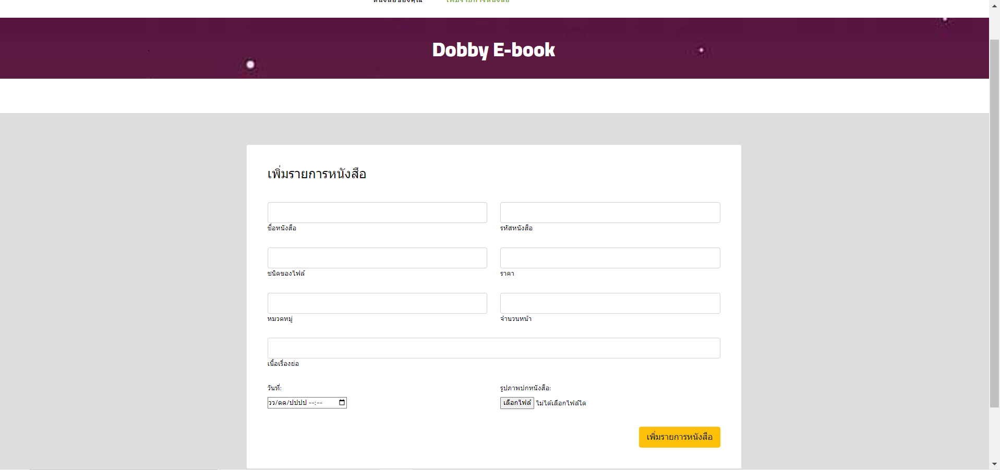

# ระบบซื้อขาย E-Book

## Conceptual Databases Design

 - การซื้อขาย E-book ใน Dobby จำเป็นต้องมี user ในการเข้าระบบโดยจะแยกเป็นนักอ่าน(reader) นักเขียน(writer) และสำนักพิมพ์(publisher)
	- **นักอ่าน**และ**นักเขียน**จะเก็บข้อมูล Firstname, Lastname, Gender, Tel(สามารถมีได้หลายเบอร์), ProfilePicture, Password, UserID(ไม่ซ้ำกัน), Email, Username, Address ประกอบด้วย Province, Street, Zipcode, District โดยสำหรับนักเขียนเราจะเก็บเฉพาะนักเขียนอิสระที่ไม่มีสำนักพิมพ์ เก็บ credit card สำหรับนักอ่าน และ receiver method สำหรับนักเขียน
	- **นักเขียนที่มีสำนักพิมพ์**จะไม่มีการเก็บข้อมูลในระบบโดยจะมีสำนักพิมพ์เป็นตัวกลางในการดำเนินการแทนซึ่งจะเก็บข้อมูลดังนี้ PublisherName, Addres ประกอบด้วย Province, Street, Zipcode, District
 - E-book จะมีได้ต้องมีนักเขียนหรือสำนักพิมพ์ ซึ่งประกอบไปด้วย BookID,Bookname,BookCover,Price,Category,FileType,length,ReleaseDate,ShortDetail(มีหรือไม่มีก็ได้),SampleRead(มีหรือไม่มีก็ได้)
 - นักอ่านสามารถเลือก E-book ใส่ตะกร้าได้โดยไม่จำเป็นต้องซื้อ
 - นักอ่านสามารถซื้อ E-book เมื่อซื้อแล้วทางระบบจะแจ้ง price,DateTime,transactionDetail แล้วนำ E-book ไปจัดเก็บใน Shelf
 - นักอ่านแต่ละคนจะมี Shelf ของตนเองซึ่งสามรถนำ e-book ทั้งที่ซื้อแล้วและยังไม่ได้ซื้อมาใส่ไว้ได้โดยจะระบุสถานะ(Status) แยกกันโดยใน Shelf ประกอบไปด้วย Status,Bookname,BookID,UserID
 - นักเขียนหรือสำนักพิมพ์ต้องมี E-book ได้มากกว่า 1 เล่ม แต่ E-book มีสำนักพิมพ์ได้แค่เดียว
 - นักอ่านสามารถเลือก E-book ใส่ตะกร้าหรือ shelf ได้หลายเล่ม และ e-book ก็สามารถมีนักอ่านได้หลายคนเช่นกัน
 - นักอ่านสามารถรีวิว E-book ที่ซื้อมาแล้วได้โดยบอก rating,description,DateTime และ E-book สามารถมีนักอ่านรีวิวได้หลายคน
## Function Component Design
 - การลงทะเบียนผู้ใช้ 
 - แก้ไขข้อมูลส่วนตัว 
 - ค้นหา e-book 
 - แนะนำหนังสือขายดี มาใหม่ โปรโมชั่น 
 - ตะกร้าสินค้า 
 - การซื้อสินค้า
 - เพิ่มรายการหนังสือสำหรับสำนักพิมพ์หรือนักเขียน 
 - แก้ไขรายละเอียดหนังสือ
 - เพิ่มหนังสือไปยังชั้นหนังสือ 
 - ลบหนังสือในชั้นหนังสือ

## ERD

## ตัวอย่างหน้าจอผู้ใช้งาน

